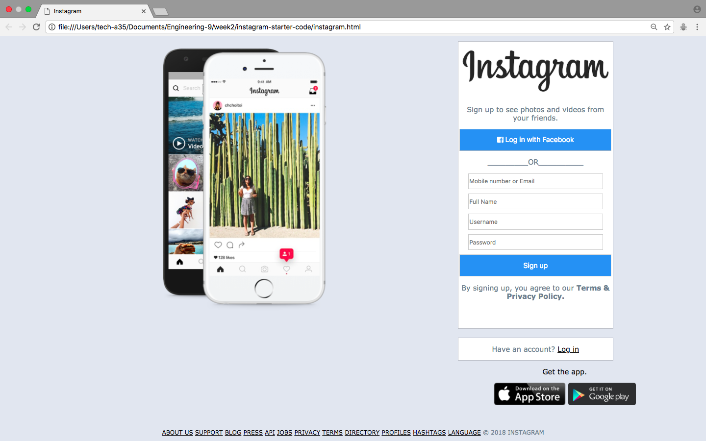
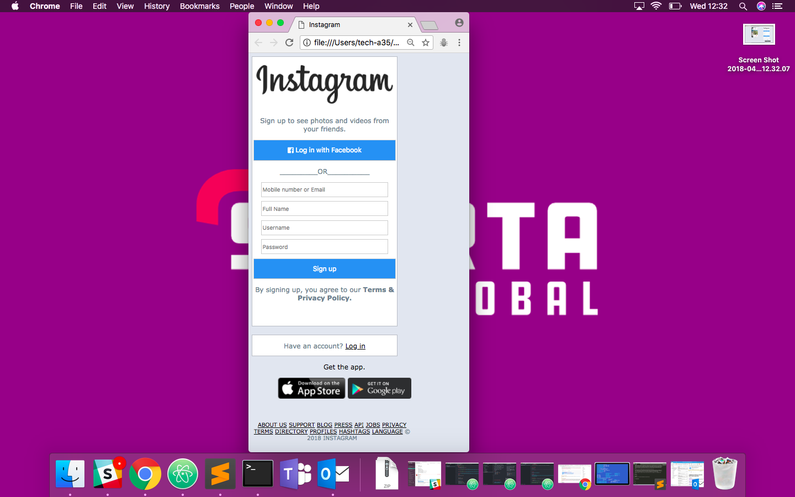

# Responsive CSS Lab

## My Responsive Instagram Login Page

**Changes I made:**
* I used media queries to instruct the browser to have the login form take up the whole screen when the user shrinks the browser window.
  ```css
  @media screen and (max-width: 700px) {
    main {
      width: 100%;
    }
    .phone {
      display: none;
    }
    footer {
      width: 75%;
    }
  }
```
* I took the Copyright text out of ```<p>``` tags so that it now sits on the same line as the rest of the items in the bottom navbar.
* I set percentage height and width values for my ```<main>``` box so that it was easier to make everything inside the main responsive.
```css
main {
  float: right;
  margin-bottom: 50px;
  width: 35%;
  height: 40%;
}
```


# The Finished Homework





